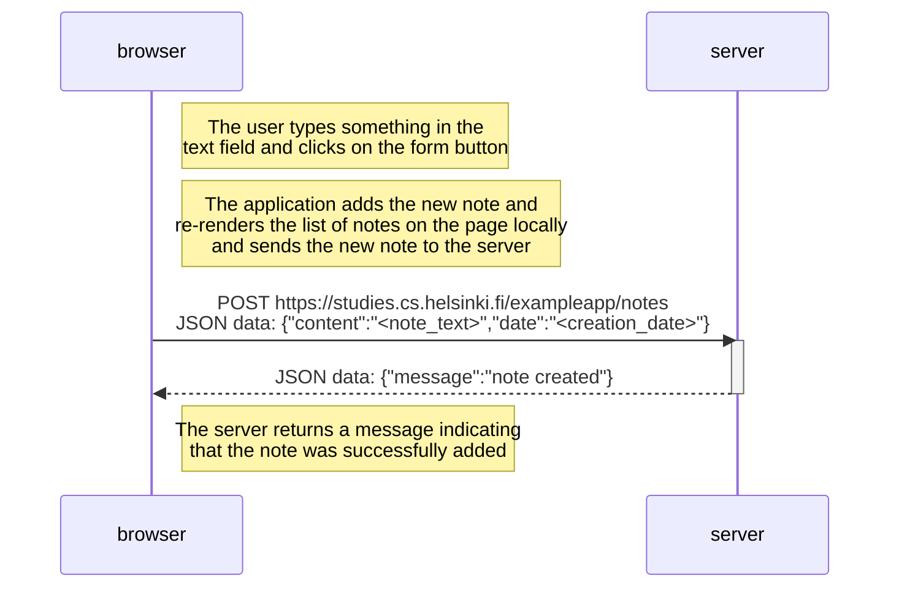

```mermaid
sequenceDiagram
    participant browser
    participant server

    Note right of browser: The user types something in the <br/>text field and clicks on the form button

    Note right of browser: The application adds the new note and <br/>re-renders the list of notes on the page locally <br/>and sends the new note to the server

    browser->>server: POST https://studies.cs.helsinki.fi/exampleapp/notes <br/> JSON data: {"content":"<note_text>","date":"<creation_date>"}
    activate server
    server-->>browser: JSON data: {"message":"note created"}
    deactivate server

    Note right of browser: The server returns a message indicating <br/>that the note was successfully added

```
